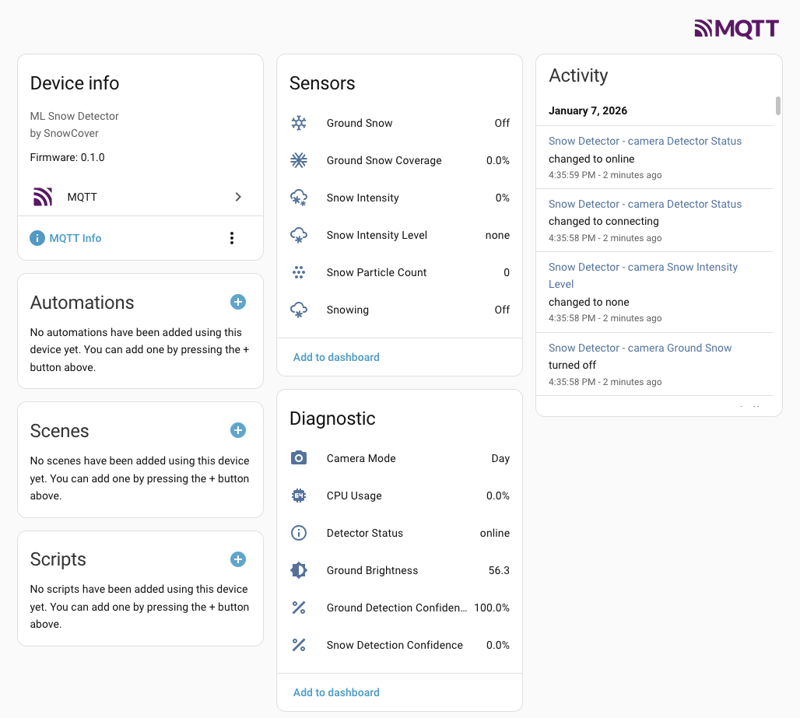
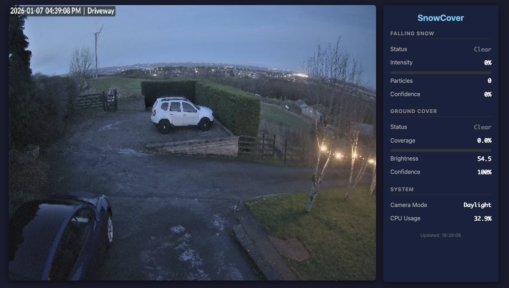
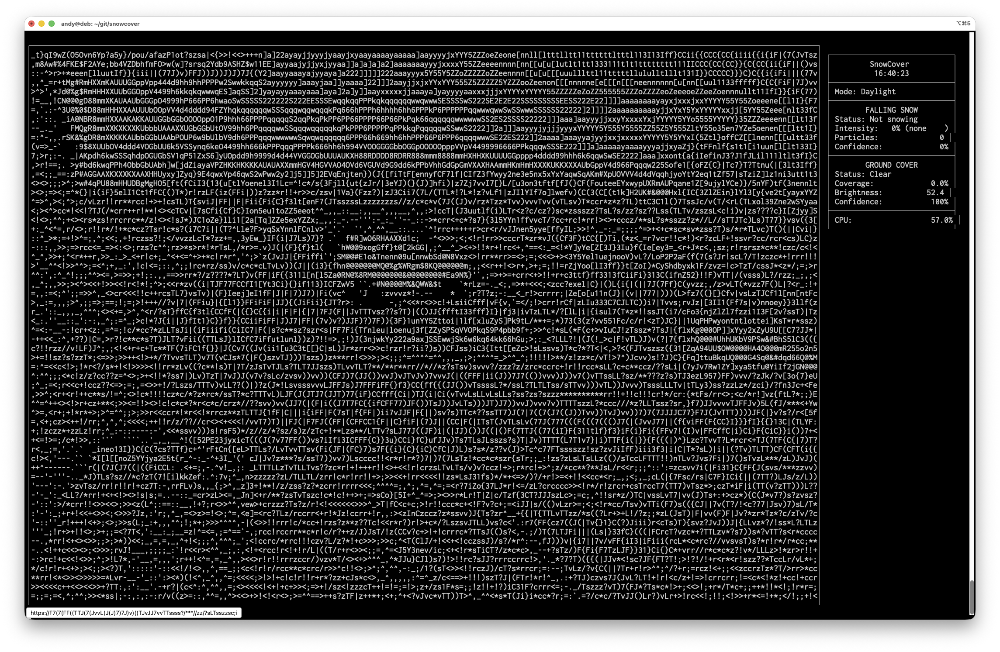

# SnowCover

**ML-powered snow detection from security cameras with Home Assistant integration.**

SnowCover watches your RTSP camera feeds and detects falling snow, measures intensity, and monitors ground snow accumulation. It publishes everything to Home Assistant via MQTT discovery, so you can automate your snow blower, driveway heater, or just get notified when it starts snowing.



## Features

- **Falling Snow Detection** — Frame differencing with particle analysis detects active snowfall
- **Snow Intensity** — Classifies as light, moderate, or heavy (0-100% scale)
- **Ground Coverage** — Monitors how much of the ground is covered in snow
- **IR/Night Vision Support** — Automatically adapts when your camera switches to night mode
- **Home Assistant Integration** — MQTT discovery creates sensors automatically
- **Built-in Web UI** — Live camera view with real-time stats
- **Standalone Mode** — Test without MQTT, including a ridiculous ASCII art mode

## Quick Start

### Docker (Recommended)

```bash
# Clone the repo
git clone https://github.com/beezly/snowcover.git
cd snowcover

# Build the image
./build.sh

# Run with environment variables
docker run -d \
  -e SNOWCOVER_CAMERA__RTSP_URL="rtsp://192.168.1.100:554/stream" \
  -e SNOWCOVER_MQTT__HOST="192.168.1.50" \
  -e SNOWCOVER_MQTT__USERNAME="homeassistant" \
  -e SNOWCOVER_MQTT__PASSWORD="your_password" \
  -e SNOWCOVER_WEB__ENABLED="true" \
  -p 8080:8080 \
  snowcover:latest
```

Or use docker-compose:

```yaml
services:
  snowcover:
    image: snowcover:latest
    restart: unless-stopped
    environment:
      SNOWCOVER_CAMERA__RTSP_URL: "rtsp://192.168.1.100:554/stream"
      SNOWCOVER_MQTT__HOST: "mqtt.local"
      SNOWCOVER_MQTT__USERNAME: "snowcover"
      SNOWCOVER_MQTT__PASSWORD: "secret"
      SNOWCOVER_WEB__ENABLED: "true"
    ports:
      - "8080:8080"
```

### Standalone Testing

Test the detection without any MQTT setup:

```bash
pip install -r requirements.txt

# Table output
python -m snowcover.main -s -u "rtsp://camera/stream"

# JSON output (for scripting)
python -m snowcover.main -s -u "rtsp://camera/stream" -f json

# Simple one-liner output
python -m snowcover.main -s -u "rtsp://camera/stream" -f simple
```

## Web Interface

Enable the built-in web server to view live camera feed and detection stats:

```bash
SNOWCOVER_WEB__ENABLED=true
```

Then open http://localhost:8080 in your browser:



The web interface provides:
- Live MJPEG video stream
- Real-time detection statistics
- Falling snow status and intensity
- Ground coverage percentage
- Camera mode indicator (Day/IR)

## Fancy Mode

For the terminal enthusiasts, there's an ASCII art mode that renders the camera feed directly in your terminal:

```bash
python -m snowcover.main -s -u "rtsp://camera/stream" -f fancy
```



It uses CLAHE enhancement, unsharp masking, and gamma correction to make the ASCII art actually readable. The stats panel updates alongside the video at 24 FPS. It's completely unnecessary and I love it.

## Home Assistant Entities

SnowCover creates these entities automatically via MQTT discovery:

| Entity | Type | Description |
|--------|------|-------------|
| `binary_sensor.snowcover_*_snowing` | Binary | Is it snowing right now? |
| `binary_sensor.snowcover_*_ground_snow` | Binary | Is the ground covered? |
| `sensor.snowcover_*_intensity` | Sensor | Snow intensity (0-100%) |
| `sensor.snowcover_*_intensity_text` | Sensor | Intensity category (none/light/moderate/heavy) |
| `sensor.snowcover_*_ground_cover` | Sensor | Ground coverage percentage |
| `sensor.snowcover_*_particle_count` | Sensor | Number of snow particles detected |
| `sensor.snowcover_*_snow_confidence` | Sensor | Detection confidence |
| `sensor.snowcover_*_camera_mode` | Sensor | Day or IR/Night |
| `sensor.snowcover_*_cpu_usage` | Sensor | Process CPU usage |

### Example Automations

```yaml
# Notify when it starts snowing
automation:
  - alias: "Snow Alert"
    trigger:
      - platform: state
        entity_id: binary_sensor.snowcover_camera_snowing
        to: "on"
    action:
      - service: notify.mobile_app
        data:
          message: "It's snowing! Intensity: {{ states('sensor.snowcover_camera_intensity_text') }}"

# Pre-heat the driveway when ground snow is detected
automation:
  - alias: "Driveway Heating"
    trigger:
      - platform: numeric_state
        entity_id: sensor.snowcover_camera_ground_cover
        above: 20
    action:
      - service: switch.turn_on
        entity_id: switch.driveway_heater
```

## Configuration

### Environment Variables

| Variable | Description | Default |
|----------|-------------|---------|
| `SNOWCOVER_CAMERA__RTSP_URL` | Camera RTSP stream URL | *required* |
| `SNOWCOVER_CAMERA__ID` | Unique camera identifier | `camera` |
| `SNOWCOVER_MQTT__HOST` | MQTT broker hostname | `localhost` |
| `SNOWCOVER_MQTT__PORT` | MQTT broker port | `1883` |
| `SNOWCOVER_MQTT__USERNAME` | MQTT username | |
| `SNOWCOVER_MQTT__PASSWORD` | MQTT password | |
| `SNOWCOVER_WEB__ENABLED` | Enable web interface | `false` |
| `SNOWCOVER_WEB__PORT` | Web server port | `8080` |
| `SNOWCOVER_PROCESSING__FRAME_RATE` | Frames per second to analyze | `1.0` |
| `SNOWCOVER_LOGGING__LEVEL` | Log level (DEBUG/INFO/WARNING/ERROR) | `INFO` |

### YAML Configuration

For advanced configuration, create a config file:

```yaml
camera:
  id: "front_camera"
  rtsp_url: "rtsp://192.168.1.100:554/stream1"
  transport: tcp  # or udp

processing:
  frame_rate: 1.0
  width: 640
  height: 480

detection:
  falling_snow:
    min_particle_count: 50
    brightness_threshold: 200
    min_particle_size: 2
    max_particle_size: 20
  ground_cover:
    ground_region:
      - [0.0, 0.6]  # Top-left of ground area
      - [1.0, 0.6]  # Top-right
      - [1.0, 1.0]  # Bottom-right
      - [0.0, 1.0]  # Bottom-left
    coverage_threshold: 30

mqtt:
  host: "192.168.1.50"
  port: 1883
  username: "homeassistant"
  password: "secret"
  discovery_prefix: "homeassistant"

web:
  enabled: true
  port: 8080
  frame_rate: 15

logging:
  level: INFO
  format: json
```

Run with: `python -m snowcover.main -c config.yaml`

## How It Works

### Falling Snow Detection

Uses frame differencing between consecutive frames to detect motion, then filters for particles that match snow characteristics:
- Size: 2-20 pixels (configurable)
- Brightness: High luminosity (snow is bright)
- Movement: Primarily downward motion

When enough particles are detected, it's snowing.

### Intensity Classification

If you provide an ONNX weather classification model at `models/weather_classifier.onnx`, it will use ML inference. Otherwise, it estimates intensity from particle density:
- **Light**: Few particles, sparse coverage
- **Moderate**: Steady snowfall
- **Heavy**: Dense particle count, reduced visibility

### Ground Coverage

Analyzes a region of the frame for snow-like pixels. The ground region can be:
- **Auto-detected** using ML segmentation (identifies roads, grass, sidewalks, etc.)
- **Manually configured** as a polygon in the config

Detection methods:
- **Day mode**: HSV color analysis (high value, low saturation = white/snow)
- **IR/Night mode**: Brightness-based detection (snow reflects IR strongly)

### IR/Night Mode Detection

Automatically detects IR mode by checking color saturation of the frame. When saturation is very low (grayscale), it switches to IR-optimized algorithms.

## ML Models (Optional)

SnowCover can use ONNX models for improved detection. These are optional — the system works without them using fallback algorithms.

### Ground Segmentation Model

Automatically identifies ground regions (roads, grass, sidewalks, dirt, etc.) using semantic segmentation. This is more accurate than manually defining a polygon.

```bash
# Install dependencies and download the model
pip install transformers optimum onnx onnxruntime
python scripts/download_segmentation_model.py
```

This downloads [SegFormer-B0](https://huggingface.co/nvidia/segformer-b0-finetuned-ade-512-512) (~14MB) trained on ADE20K and exports it to `models/ground_segmentation.onnx`.

### Weather Classification Model

For snow intensity classification, you can provide a custom ONNX model at `models/weather_classifier.onnx`. Without it, intensity is estimated from particle density.

## Troubleshooting

**Camera won't connect**
- Test the URL: `ffplay "rtsp://your-camera-url"`
- Try TCP transport: add `?rtsp_transport=tcp` to the URL
- Check firewall rules

**Too many false positives**
- Increase `min_particle_count` (default: 50)
- Increase `brightness_threshold` (default: 200)
- Check if bugs/rain are triggering detection

**Ground detection wrong**
- Adjust `ground_region` to match your camera's view
- Tune `coverage_threshold` for your conditions

**Entities not appearing in Home Assistant**
- Check MQTT broker connection in logs
- Verify HA MQTT integration is configured
- Try reloading the MQTT integration

## Development

```bash
# Install with dev dependencies
pip install -e ".[dev]"

# Run tests
pytest

# Format code
black src/

# Type checking
mypy src/

# Lint
ruff src/
```

## License

MIT License — see LICENSE for details.
